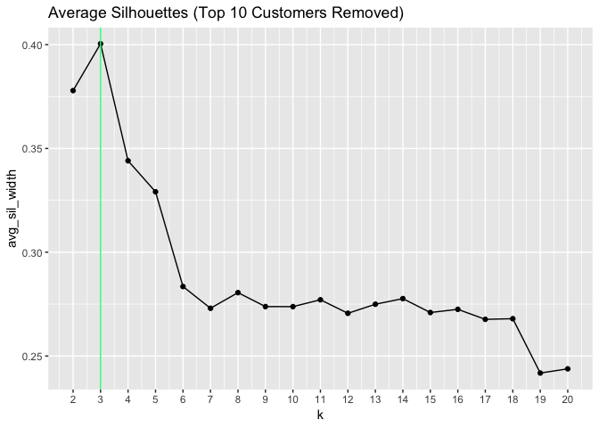

Wholesale Customers - Clustering in R
================
Nancy Huynh
2019-02-22

-   [Clustering Wholesale Customers](#clustering-wholesale-customers)
    -   [Data Imports and Libraries](#data-imports-and-libraries)
    -   [Data Exploration](#data-exploration)
        -   [The Wholesale Customers Data](#the-wholesale-customers-data)
        -   [Scatterplot Matrix & Boxplots](#scatterplot-matrix-boxplots)
        -   [Left-skewed Variables](#left-skewed-variables)
        -   [Correlation Matrix](#correlation-matrix)
    -   [HDBSCAN (Hierarchical Density-Based Spatial Clustering of Applications with Noise)](#hdbscan-hierarchical-density-based-spatial-clustering-of-applications-with-noise)
        -   [HDBSCAN minPts = 6](#hdbscan-minpts-6)
        -   [HDBSCAN minPts = 5](#hdbscan-minpts-5)
        -   [HDBSCAN Summary](#hdbscan-summary)
    -   [K-Means Clustering](#k-means-clustering)
        -   [Function for Top-n Cutomers](#function-for-top-n-cutomers)
        -   [Suitable K - How Many Clusters?](#suitable-k---how-many-clusters)
        -   [K-means for "Suitable" Ks](#k-means-for-suitable-ks)
        -   [K-means Summary](#k-means-summary)
    -   [Next Steps](#next-steps)
    -   [Overall Thoughts](#overall-thoughts)

Clustering Wholesale Customers
==============================

After taking an introductory course on clustering in R at Datacamp I applied it to customer data of a wholesale company that's freely available from the [UCI Machine Learning Library](https://archive.ics.uci.edu/ml/datasets/Wholesale+customers). The aim is to segment the customers in a way that could be useful for marketing/sales.

Data Imports and Libraries
--------------------------

``` r
## LOAD LIBRARIES
library(tidyverse)
library(cluster)
library(corrplot)
library(dbscan)
```

``` r
## IMPORT DATA
file_path<- file.path("~", "Data for R", "wholesale_customers_data.csv")
whole_cust_full <- read_csv(file_path)
```

    ## Parsed with column specification:
    ## cols(
    ##   Channel = col_double(),
    ##   Region = col_double(),
    ##   Fresh = col_double(),
    ##   Milk = col_double(),
    ##   Grocery = col_double(),
    ##   Frozen = col_double(),
    ##   Detergents_Paper = col_double(),
    ##   Delicassen = col_double()
    ## )

Data Exploration
----------------

### The Wholesale Customers Data

There are two categorical variables (Channel, Region) and six continous variables on the amount (monetary unit) purchased by customers on each category (Fresh, Milk, Grocery, Frozen, Detergents\_Paper, Delicassen). Total of 440 observations with no missing values.

``` r
str(whole_cust_full)
```

    ## Classes 'spec_tbl_df', 'tbl_df', 'tbl' and 'data.frame': 440 obs. of  8 variables:
    ##  $ Channel         : num  2 2 2 1 2 2 2 2 1 2 ...
    ##  $ Region          : num  3 3 3 3 3 3 3 3 3 3 ...
    ##  $ Fresh           : num  12669 7057 6353 13265 22615 ...
    ##  $ Milk            : num  9656 9810 8808 1196 5410 ...
    ##  $ Grocery         : num  7561 9568 7684 4221 7198 ...
    ##  $ Frozen          : num  214 1762 2405 6404 3915 ...
    ##  $ Detergents_Paper: num  2674 3293 3516 507 1777 ...
    ##  $ Delicassen      : num  1338 1776 7844 1788 5185 ...
    ##  - attr(*, "spec")=
    ##   .. cols(
    ##   ..   Channel = col_double(),
    ##   ..   Region = col_double(),
    ##   ..   Fresh = col_double(),
    ##   ..   Milk = col_double(),
    ##   ..   Grocery = col_double(),
    ##   ..   Frozen = col_double(),
    ##   ..   Detergents_Paper = col_double(),
    ##   ..   Delicassen = col_double()
    ##   .. )

``` r
summary(whole_cust_full)
```

    ##     Channel          Region          Fresh             Milk      
    ##  Min.   :1.000   Min.   :1.000   Min.   :     3   Min.   :   55  
    ##  1st Qu.:1.000   1st Qu.:2.000   1st Qu.:  3128   1st Qu.: 1533  
    ##  Median :1.000   Median :3.000   Median :  8504   Median : 3627  
    ##  Mean   :1.323   Mean   :2.543   Mean   : 12000   Mean   : 5796  
    ##  3rd Qu.:2.000   3rd Qu.:3.000   3rd Qu.: 16934   3rd Qu.: 7190  
    ##  Max.   :2.000   Max.   :3.000   Max.   :112151   Max.   :73498  
    ##     Grocery          Frozen        Detergents_Paper    Delicassen     
    ##  Min.   :    3   Min.   :   25.0   Min.   :    3.0   Min.   :    3.0  
    ##  1st Qu.: 2153   1st Qu.:  742.2   1st Qu.:  256.8   1st Qu.:  408.2  
    ##  Median : 4756   Median : 1526.0   Median :  816.5   Median :  965.5  
    ##  Mean   : 7951   Mean   : 3071.9   Mean   : 2881.5   Mean   : 1524.9  
    ##  3rd Qu.:10656   3rd Qu.: 3554.2   3rd Qu.: 3922.0   3rd Qu.: 1820.2  
    ##  Max.   :92780   Max.   :60869.0   Max.   :40827.0   Max.   :47943.0

``` r
dim(whole_cust_full)
```

    ## [1] 440   8

``` r
sum(is.na(whole_cust_full))
```

    ## [1] 0

For this analysis the two categorical variables will be dropped. There's more learning and research I have to do for clustering mixed data types that I'll post in the future.

``` r
whole_cust <- select(whole_cust_full, -Channel, -Region)
```

### Scatterplot Matrix & Boxplots

Visual inspection of the continous variables in the scatterplot matrix shows there's possibly a number of outliers. Added some side-by-side boxplots for further inspection also points to a number of outliers for each variable.


``` r
whole_cust %>% 
  gather(key = Category, value = Amount) %>%
  ggplot(aes(x = Category, y = Amount)) +
  geom_boxplot(alpha = 0.2)
```


### Left-skewed Variables

All variables are left-skewed, and we can also see some relatively very high spenders for each category. While applying a `log()` transformation to each variable makes them more normally distributed (not shown), I opted not to use a log transformation when running k-means and HDBSCAN below. HDBSCAN is supposed to deal well with outliers anyway. Meanwhile, k-means on the log-transformed data would cluster big spenders with more moderate spenders as the algorithm is designed to reduce within-cluster sum of squares. When it comes to sales/marketing the big spending customers should be a segment of its own. In the case of wholesale customers, it would make sense to treat these top spenders on a more bespoke basis as there probably aren't as many compared to consumer-type of business.

``` r
whole_cust %>% 
  gather(key = Category, value = Amount) %>%
  ggplot(aes(x = Amount)) +
  geom_histogram(bins = 100) +
  facet_wrap(~ Category, scales = "free")
```


#### Dealing with Outliers?

My original plan was to run the k-means algorithm, but with these outliers it is likely that some of the customers wouldn't fit well into a cluster. K-means would include every observation into a cluster. After some research I found that DBSCAN and HDBSCAN clustering algorithms take into account "noise" (i.e. outliers). Both of these options do not force *every* data point into a cluster -- if a data point lies outside of the specified starting parameters, it will be classified as "noise" and not included in any resulting cluster. In addition to running HDBSCAN, out of curiosity, I also ran k-means in two scenarios:

-   all customer purchase data
-   customer purchase data excluding the top 10 customers from each of the six categories

### Correlation Matrix

There's fairly high positive correlation between Milk and Grocery, Milk and Detergents\_Paper, and very high positive correlation between Grocery and Detergents\_Paper. Knowing the purchases correlations could be useful when considering sales/marketing strategies once the customers have been segmented. For example, a sales person working with a new customer who is ordering a lot of Grocery items could recommend some Detergents\_Paper products.

``` r
corrplot.mixed(cor(whole_cust), lower.col = "grey", tl.cex = 0.7, order = "FPC")
```


HDBSCAN (Hierarchical Density-Based Spatial Clustering of Applications with Noise)
----------------------------------------------------------------------------------

With `minPts` greater than 11 the HDBSCAN function is unable to produce stable clusters. The `minPts` are the minimum number of data points per cluster. The number of noise points and number of clusters are summarized for minPts 2 to 11:

| minPts | \# Clusters | \# Noise |
|:------:|:-----------:|:--------:|
|   11   |      2      |    414   |
|   10   |      2      |    405   |
|    9   |      2      |    273   |
|    8   |      2      |    275   |
|    7   |      2      |    91    |
|    6   |      2      |    85    |
|    5   |      4      |    115   |
|    4   |      9      |    217   |
|    3   |      8      |    87    |
|    2   |     107     |    150   |

With only 440 observations not much clustering is being done if over 50% (220) of the points are considered noise, which rules out a number of the minPts. This leaves minPts of 7, 6, 5, 3, 2. Meanwhile 8+ clusters is too many, especially since most of the clusters are very small with one large cluster. Thus, minPts 7, 6, 5 make the most sense. For minPts 7 and 6, the clusters were very similar--one small cluster and one very large cluster. And for minPts = 5, there are 3 clusters that are very small and one large 4th cluster. The clusters found with minPts 5 and 6 showed customers who primarily spend a lot in the Fresh category (and less of everything else) is its own cluster.

#### HDBSCAN minPts = 6

``` r
model_hdb_6 <- hdbscan(whole_cust, minPts = 6)
print(model_hdb_6)
```

    ## HDBSCAN clustering for 440 objects.
    ## Parameters: minPts = 6
    ## The clustering contains 2 cluster(s) and 85 noise points.
    ## 
    ##   0   1   2 
    ##  85   8 347 
    ## 
    ## Available fields: cluster, minPts, cluster_scores,
    ##                   membership_prob, outlier_scores, hc

``` r
whole_cust %>% 
  mutate(cluster = model_hdb_6$cluster) %>%
  group_by(cluster) %>%
  summarise_all(mean) #cluster 0 is noise
```

    ## # A tibble: 3 x 7
    ##   cluster  Fresh   Milk Grocery Frozen Detergents_Paper Delicassen
    ##     <dbl>  <dbl>  <dbl>   <dbl>  <dbl>            <dbl>      <dbl>
    ## 1       0 22444. 13105.  16980.  6805.            6355.      3366.
    ## 2       1 40274.  1765.   2440.  2130.             400.      1266.
    ## 3       2  8790.  4099.   5867.  2179.            2088.      1080.

``` r
plot(model_hdb_6, show_flat = TRUE)
```


*Note: rectangles drawn around stable clusters (numbered)*

The "noise" data looks to have pretty high averages for all categories. Based on the histograms we can see they're not just big spenders, although there are some.

``` r
whole_cust %>% 
  mutate(cluster = model_hdb_6$cluster) %>%
  gather(key = Category, value = Amount, -cluster) %>%
  filter(cluster == 0) %>%
  ggplot(aes(x = Amount)) +
  geom_histogram(bins = 25) +
  facet_wrap(~Category, scales = "free")
```


#### HDBSCAN minPts = 5

The 4 clusters identified here show 3 small clusters that appear to have fairly distinct average spending in each category. For example cluster 3 spends a lot on Milk, Grocery and Detergents\_Paper, cluster 2 are big Fresh-primarily spenders. And cluster 1 looks to be big spenders in Frozen and Fresh (but not as big as cluster 2).

``` r
model_hdb_5 <- hdbscan(whole_cust, minPts = 5)
print(model_hdb_5)
```

    ## HDBSCAN clustering for 440 objects.
    ## Parameters: minPts = 5
    ## The clustering contains 4 cluster(s) and 115 noise points.
    ## 
    ##   0   1   2   3   4 
    ## 115   5   7   6 307 
    ## 
    ## Available fields: cluster, minPts, cluster_scores,
    ##                   membership_prob, outlier_scores, hc

``` r
whole_cust %>% 
  mutate(cluster = model_hdb_5$cluster) %>%
  group_by(cluster) %>%
  summarise_all(mean) #cluster 0 is noise
```

    ## # A tibble: 5 x 7
    ##   cluster  Fresh   Milk Grocery Frozen Detergents_Paper Delicassen
    ##     <dbl>  <dbl>  <dbl>   <dbl>  <dbl>            <dbl>      <dbl>
    ## 1       0 18637. 11873.  16139.  5462.            6289.      2852.
    ## 2       1 24117.  4652    4536.  9932.             656.      2318.
    ## 3       2 40582.  2302.   3137.  1629.             750.      1394.
    ## 4       3  4398. 13008.  21555   2178.            8368.       860.
    ## 5       4  8814.  3477.   4784.  2115.            1583.      1031.

``` r
plot(model_hdb_5, show_flat = TRUE)
```


*Note: rectangles drawn around stable clusters (numbered)*

Let's see what the largest cluster looks likes with some histograms.

``` r
whole_cust %>% 
  mutate(cluster = model_hdb_5$cluster) %>%
  gather(key = Category, value = Amount, -cluster) %>%
  filter(cluster == 4) %>%
  ggplot(aes(x = Amount)) +
  geom_histogram(bins = 25) +
  facet_wrap(~Category, scales = "free")
```


### HDBSCAN Summary

While the clusters are quite uneven, there's definitely a group of customers that spend a lot in the Fresh category and much less of everything else. There's also a large-sized cluster that appears to spend pretty evenly across the categories on average.

K-Means Clustering
------------------

As mentioned, I ran K-Means for all the customer purchase data and a subset that excludes the top 10 customers.

### Function for Top-n Cutomers

This function returns the index positions of the top-n customers in each category. Only unique index positions are retruned.

``` r
top_n_cust <- function(df, n = 1, cols = dim(df)[2]) {
  indx <- lapply(1:cols, function(col){
    col_ordered <- order(as.numeric(unlist(df[, col])), decreasing = TRUE)
    head(col_ordered, n)
  })
  
  return(unique(as_vector(indx)))
}
```

The dataframe `whole_cust_rm_top` is the subset without the top 10 customers from each category

``` r
top_10_cust <- top_n_cust(whole_cust, 10)
whole_cust_rm_top <- whole_cust[-top_10_cust, ]
```

### Suitable K - How Many Clusters?

In order to cluster the data we first need to decide on a suitable k, that is the number of clusters we want. I've learned a few ways to find a suitable k value. They are below. After using these methods, contextual business logic also needs to be considered in real life. For example, is k = 10 segments reasonable for the marketing team to target? or is it too many to be practical?

#### Summary of suitable k-values

|   Method   | Full | Subset |
|:----------:|:----:|:------:|
|    Elbow   |   5  |    5   |
| Silhouette |   2  |    3   |
|     Gap    |  8+  |   8+   |

*Note: The optimal number of clusters from calculating Gap statistic were different for different runs*

#### Elbow plot method

Plot of total within-cluster sum of squares for k values from 2 to 20. Note that the elbow plots don't show a very strong "elbow". Around k = 5 the slope starts to dramatically decrease in steepness so a suitable k may be 5.

For all customers

``` r
avg_tot_within_ss <- map_dbl(2:20, function(k){
  model <- kmeans(whole_cust, centers = k)
  model$tot.withinss
})

plot_wss_df <- data.frame(
  k = 2:20,
  avg_tot_within_ss = avg_tot_within_ss
)

ggplot(plot_wss_df, aes(x = k, y = avg_tot_within_ss)) +
  geom_line() +
  geom_point() +
  geom_vline(xintercept = 5, color = "dodgerBlue") +
  scale_x_continuous(breaks = 2:20) +
  labs(title = "Elbow Plot (All Customers)")
```


For subset with top 10 customers (code is similar so not showing it)


#### Silhouette analysis

The "best"" k is the one with the highest average silhouette width. This means that compared to the other values of k tried, with the "best" k the data points in each of the clusters is best matched to its cluster. The best k for the full data set is k = 2, and for the subset k = 3.

For all customers

``` r
avg_sil_width <- map_dbl(2:20, function(k){
  model <- kmeans(whole_cust, centers = k, nstart = 25)
  sil <- silhouette(model$cluster, dist(whole_cust))
  mean(sil[ , 3])
})

plot_sw_df <- data.frame(
  k = 2:20,
  avg_sil_width = avg_sil_width
)

ggplot(plot_sw_df, aes(x = k, y = avg_sil_width)) +
  geom_line() +
  geom_point() +
  scale_x_continuous(breaks = 2:20) +
  geom_vline(xintercept = 2, color = "springGreen") +
  labs(title = "Average Silhouettes (All Customers)")
```


For the subset



#### Gap statistic

The gap statistic compares the total within-cluster variation for different values of k with their expected values under null reference distribution of the data (i.e. a distribution with no obvious clustering). The optimal k depends on the method we choose. The default for `clusGap` is "firstSEmax", which chooses the smallest k where the Gap statistic is not more than 1 standard error away from the first local maximum. Interestingly I ran `clusGap` a few different times and each time I got different optimal number of clusters ranging from 8-14 for both the full dataset and the subset. K-means actually seems quite unstable for both the full data and the subset with the top 10 customers removed.

For all customers

``` r
gap_stat <- clusGap(whole_cust, FUN = kmeans, nstart = 25, iter.max = 30, K.max = 20)
print(gap_stat)
```

    ## Clustering Gap statistic ["clusGap"] from call:
    ## clusGap(x = whole_cust, FUNcluster = kmeans, K.max = 20, nstart = 25,     iter.max = 30)
    ## B=100 simulated reference sets, k = 1..20; spaceH0="scaledPCA"
    ##  --> Number of clusters (method 'firstSEmax', SE.factor=1): 14
    ##           logW   E.logW      gap      SE.sim
    ##  [1,] 14.64325 15.93964 1.296385 0.011655992
    ##  [2,] 14.46254 15.77757 1.315029 0.011517220
    ##  [3,] 14.29678 15.66112 1.364342 0.010417213
    ##  [4,] 14.20351 15.57729 1.373775 0.010464138
    ##  [5,] 14.10180 15.53259 1.430792 0.010163221
    ##  [6,] 14.04422 15.49312 1.448901 0.010187881
    ##  [7,] 13.96612 15.45809 1.491967 0.010250103
    ##  [8,] 13.93098 15.42643 1.495449 0.010366610
    ##  [9,] 13.88368 15.39815 1.514478 0.010431035
    ## [10,] 13.83684 15.37210 1.535265 0.010374825
    ## [11,] 13.80773 15.34759 1.539863 0.010292416
    ## [12,] 13.76635 15.32445 1.558101 0.010217408
    ## [13,] 13.72432 15.30317 1.578856 0.010443331
    ## [14,] 13.69164 15.28334 1.591706 0.010003184
    ## [15,] 13.67717 15.26423 1.587063 0.009875287
    ## [16,] 13.64355 15.24615 1.602597 0.009588540
    ## [17,] 13.61817 15.22880 1.610622 0.009367414
    ## [18,] 13.61026 15.21250 1.602245 0.009733720
    ## [19,] 13.56498 15.19664 1.631655 0.009477429
    ## [20,] 13.54618 15.18207 1.635891 0.009043453

For the subset

    ## Clustering Gap statistic ["clusGap"] from call:
    ## clusGap(x = whole_cust_rm_top, FUNcluster = kmeans, K.max = 20,     nstart = 25, iter.max = 30)
    ## B=100 simulated reference sets, k = 1..20; spaceH0="scaledPCA"
    ##  --> Number of clusters (method 'firstSEmax', SE.factor=1): 8
    ##           logW   E.logW       gap      SE.sim
    ##  [1,] 14.29141 14.85709 0.5656744 0.011204401
    ##  [2,] 14.04872 14.64488 0.5961580 0.012026621
    ##  [3,] 13.82662 14.53375 0.7071225 0.010980769
    ##  [4,] 13.72519 14.44470 0.7195068 0.009386818
    ##  [5,] 13.63389 14.39442 0.7605313 0.009476048
    ##  [6,] 13.57001 14.35350 0.7834931 0.009232707
    ##  [7,] 13.52561 14.31805 0.7924379 0.009200083
    ##  [8,] 13.48201 14.28645 0.8044476 0.009210040
    ##  [9,] 13.45986 14.25763 0.7977698 0.009568821
    ## [10,] 13.41387 14.23134 0.8174659 0.009715200
    ## [11,] 13.38236 14.20739 0.8250269 0.009748903
    ## [12,] 13.35839 14.18582 0.8274286 0.009934004
    ## [13,] 13.33869 14.16557 0.8268856 0.010117153
    ## [14,] 13.30372 14.14694 0.8432227 0.009790577
    ## [15,] 13.27536 14.12940 0.8540418 0.009968894
    ## [16,] 13.24849 14.11286 0.8643752 0.010088768
    ## [17,] 13.22288 14.09721 0.8743282 0.010048369
    ## [18,] 13.19422 14.08216 0.8879393 0.010206836
    ## [19,] 13.17675 14.06765 0.8908961 0.009616434
    ## [20,] 13.15927 14.05356 0.8942908 0.009925562

### K-means for "Suitable" Ks

None of the methods for finding a suitable k gave the same results. To me, 10+ clusters or customer segments seems too high to make much marketing sense, especially if we assume that the 440 observations represents the total number of customers for the business. So k-means was computed for k = 5 and k = 2 against the full data, and k = 5 and k = 3 against the subset.

#### All customers, k = 5

Clusters 1 and 2 both have relatively much higher average spend on Fresh products compared to the other categories -- although overall cluster 2 has higher average spend across all categories except Detergents\_Paper. Cluster 5 are big spenders in Fresh, Milk, Grocery, and Detergents\_Paper. While cluster 4 has relatively higher average spend on Milk, Grocery, and Detergents\_Paper. Cluster 3, the largest sized one, appears to be lower spenders across most categories.

``` r
set.seed(888)
model_k5 <- kmeans(whole_cust, centers = 5)
clusplot(whole_cust, model_k5$cluster, color = TRUE, shade = TRUE, lines = 0)
```


``` r
print(model_k5)
```

    ## K-means clustering with 5 clusters of sizes 113, 24, 227, 71, 5
    ## 
    ## Cluster means:
    ##       Fresh      Milk   Grocery   Frozen Detergents_Paper Delicassen
    ## 1 20600.283  3787.832  5089.841 3989.071         1130.142   1639.071
    ## 2 48777.375  6607.375  6197.792 9462.792          932.125   4435.333
    ## 3  5655.819  3567.793  4513.040 2386.529         1437.559   1005.031
    ## 4  5207.831 13191.028 20321.718 1674.028         9036.380   1937.944
    ## 5 25603.000 43460.600 61472.200 2636.000        29974.200   2708.800
    ## 
    ## Clustering vector:
    ##   [1] 3 3 3 1 1 3 3 3 3 4 3 3 1 1 1 3 3 3 1 3 1 3 1 4 1 1 3 1 4 2 1 3 1 1 3
    ##  [36] 3 1 1 4 2 1 1 4 4 3 4 4 5 3 4 3 3 2 4 1 3 4 4 1 3 3 5 3 4 3 4 3 1 3 3
    ##  [71] 1 1 3 1 3 1 3 4 3 3 3 4 3 1 3 5 5 2 3 1 3 1 4 1 4 3 3 3 3 3 4 4 3 2 1
    ## [106] 1 3 4 3 4 3 4 1 1 1 3 3 3 1 3 1 3 3 3 2 2 1 1 3 2 3 3 1 3 3 3 3 3 1 3
    ## [141] 1 1 2 3 1 4 3 3 3 1 1 3 1 3 3 4 4 1 3 4 3 3 1 4 3 4 3 3 3 3 4 4 3 4 3
    ## [176] 3 2 3 3 3 3 2 3 2 3 3 3 3 3 4 1 1 3 4 3 1 1 3 3 3 4 4 1 3 3 4 3 3 3 4
    ## [211] 1 4 3 3 3 4 4 1 4 3 1 3 3 3 3 3 1 3 3 3 3 3 1 3 1 3 3 1 3 2 1 1 1 3 3
    ## [246] 4 3 1 1 3 3 4 3 1 3 1 3 3 2 2 3 3 1 3 4 4 4 1 4 1 3 3 3 2 3 3 1 3 3 1
    ## [281] 3 3 2 1 2 2 3 1 1 2 3 3 3 4 1 3 1 3 3 3 1 4 3 4 4 3 4 1 3 4 3 1 4 3 3
    ## [316] 4 3 3 3 4 3 3 1 1 1 2 3 3 1 3 3 4 1 5 1 1 1 3 3 3 3 3 3 4 3 3 4 1 3 4
    ## [351] 3 4 3 4 1 3 1 4 3 3 1 3 3 3 3 3 3 3 1 3 2 1 3 1 3 3 4 2 3 3 1 1 1 3 4
    ## [386] 3 3 1 3 3 3 3 3 1 3 3 3 3 3 3 3 1 1 1 1 3 1 4 3 3 3 3 3 3 3 3 4 3 4 3
    ## [421] 3 1 1 1 1 3 4 1 3 3 3 3 1 3 1 1 2 4 3 3
    ## 
    ## Within cluster sum of squares by cluster:
    ## [1]  9394958498 16226867469 10804478229 11008166107  5682449098
    ##  (between_SS / total_SS =  66.3 %)
    ## 
    ## Available components:
    ## 
    ## [1] "cluster"      "centers"      "totss"        "withinss"    
    ## [5] "tot.withinss" "betweenss"    "size"         "iter"        
    ## [9] "ifault"

#### All customers, k = 2

Cluster 2, the smaller sized cluster, appears to be bigger spenders who buy lots of Fresh products. Cluster 1 is everyone else.

``` r
set.seed(888)
model_k2 <- kmeans(whole_cust, centers = 2)
clusplot(whole_cust, model_k2$cluster, color = TRUE, shade = TRUE, lines = 0)
```


``` r
print(model_k2)
```

    ## K-means clustering with 2 clusters of sizes 375, 65
    ## 
    ## Cluster means:
    ##       Fresh     Milk   Grocery   Frozen Detergents_Paper Delicassen
    ## 1  7944.112 5151.819  7536.128 2484.131         2872.557   1214.261
    ## 2 35401.369 9514.231 10346.369 6463.092         2933.046   3316.846
    ## 
    ## Clustering vector:
    ##   [1] 1 1 1 1 2 1 1 1 1 1 1 1 2 1 2 1 1 1 1 1 1 1 2 2 2 1 1 1 1 2 1 1 1 2 1
    ##  [36] 1 2 1 1 2 2 1 1 1 1 1 1 2 1 1 1 1 2 1 2 1 1 1 1 1 1 2 1 1 1 1 1 1 1 1
    ##  [71] 1 1 1 1 1 1 1 1 1 1 1 1 1 1 1 2 2 2 1 2 1 1 1 1 1 1 1 1 1 1 1 1 1 2 1
    ## [106] 1 1 1 1 1 1 1 1 1 1 1 1 1 1 1 1 1 1 1 2 2 1 1 1 2 1 1 1 1 1 1 1 1 1 1
    ## [141] 1 2 2 1 1 2 1 1 1 2 1 1 1 1 1 1 1 1 1 1 1 1 1 1 1 1 1 1 1 1 1 1 1 1 1
    ## [176] 1 2 1 1 1 1 2 1 2 1 1 1 1 1 1 1 1 1 1 1 1 2 1 1 1 1 1 2 1 1 1 1 1 1 1
    ## [211] 1 1 1 1 1 1 1 1 1 1 1 1 1 1 1 1 1 1 1 1 1 1 2 1 1 1 1 1 1 2 2 2 1 1 1
    ## [246] 1 1 1 1 1 1 1 1 2 1 2 1 1 2 2 1 1 1 1 1 1 1 1 1 1 1 1 1 2 1 1 2 1 1 1
    ## [281] 1 1 2 2 2 2 1 1 1 2 1 1 1 1 1 1 1 1 1 1 1 1 1 1 1 1 1 1 1 1 1 2 1 1 1
    ## [316] 1 1 1 1 1 1 1 1 1 2 2 1 1 1 1 1 1 1 1 1 2 1 1 1 1 1 1 1 1 1 1 1 2 1 1
    ## [351] 1 1 1 1 1 1 1 1 1 1 1 1 1 1 1 1 1 1 1 1 2 1 1 1 1 1 1 2 1 1 2 1 2 1 1
    ## [386] 1 1 1 1 1 1 1 1 2 1 1 1 1 1 1 1 2 2 2 1 1 2 1 1 1 1 1 1 1 1 1 1 1 1 1
    ## [421] 1 1 2 1 1 1 1 2 1 1 1 1 1 1 1 2 2 1 1 1
    ## 
    ## Within cluster sum of squares by cluster:
    ## [1] 60341401922 52876126599
    ##  (between_SS / total_SS =  28.2 %)
    ## 
    ## Available components:
    ## 
    ## [1] "cluster"      "centers"      "totss"        "withinss"    
    ## [5] "tot.withinss" "betweenss"    "size"         "iter"        
    ## [9] "ifault"

#### Subset excluding top 10 customers, k = 5

Again, we see that cluster 1 spends relatively on average more on Fresh products. Meanwhile cluster 2 are big Grocery and Detergents\_Paper spenders. Cluster 3 again, the largest sized one, appear to be lower spenders across most categories. Cluster 5 appear to be more moderate spenders across most categories. And cluster 4 spends more on average in Milk, Groceries and Delicassen.

``` r
set.seed(888)
model_k5_2 <- kmeans(whole_cust_rm_top, centers = 5)
clusplot(whole_cust_rm_top, model_k5_2$cluster, color = TRUE, shade = TRUE, lines = 0)
```


``` r
print(model_k5_2)
```

    ## K-means clustering with 5 clusters of sizes 102, 23, 179, 27, 73
    ## 
    ## Cluster means:
    ##       Fresh      Milk   Grocery    Frozen Detergents_Paper Delicassen
    ## 1 23761.225  3828.647  4985.765 3625.6863         1109.578  1508.7157
    ## 2  1278.174  7734.957 18777.870  879.7826         8855.043  1218.0870
    ## 3  6908.112  2271.648  2818.939 2521.4302          604.838   894.6201
    ## 4  7282.074 15539.481 21090.852 2149.8889         8582.667  1637.1111
    ## 5  4703.890  7474.808  9551.699 1310.5616         3996.521  1232.0137
    ## 
    ## Clustering vector:
    ##   [1] 5 5 3 1 5 3 5 3 4 5 3 1 1 1 3 5 3 1 5 1 3 1 1 1 3 3 4 1 1 3 1 1 3 5 1
    ##  [36] 5 4 1 1 5 2 5 4 4 5 4 3 5 1 5 1 3 5 3 5 5 5 4 3 5 1 3 3 1 3 1 5 1 3 4
    ##  [71] 3 3 3 2 5 1 3 3 1 3 3 5 3 5 3 3 3 5 2 5 3 3 5 4 5 4 3 4 1 3 1 3 3 3 1
    ## [106] 3 1 3 3 5 1 1 1 5 1 3 3 3 3 3 3 5 5 3 3 1 1 1 3 1 3 3 3 1 1 3 1 3 3 2
    ## [141] 2 1 5 2 5 3 3 4 5 4 5 3 3 3 2 5 2 3 5 3 3 3 5 5 3 3 3 5 5 5 1 3 3 2 3
    ## [176] 1 5 3 3 4 4 3 3 2 3 5 5 4 1 3 5 5 2 1 3 3 5 3 3 3 3 1 3 3 3 3 5 1 3 1
    ## [211] 3 3 1 3 1 1 1 3 5 2 3 3 1 3 3 3 1 5 1 3 3 3 3 1 3 2 4 2 1 4 3 3 3 5 1
    ## [246] 3 3 1 3 1 3 3 1 1 3 1 1 1 3 3 3 5 1 3 1 3 5 3 1 4 5 2 2 5 4 1 3 4 3 1
    ## [281] 2 3 3 5 3 3 3 4 3 3 1 3 1 3 3 1 3 3 4 1 1 1 3 3 3 5 5 5 2 3 5 2 1 3 4
    ## [316] 3 2 3 2 3 3 1 2 5 3 1 3 3 3 3 5 3 3 1 3 1 1 3 1 3 3 5 1 3 5 1 1 1 3 4
    ## [351] 3 3 1 3 3 3 3 3 1 3 3 5 3 3 3 3 1 1 1 1 3 1 4 3 3 3 3 5 3 5 5 5 2 3 5
    ## [386] 1 1 1 1 3 5 1 3 3 5 3 1 3 1 1 1 4 3 3
    ## 
    ## Within cluster sum of squares by cluster:
    ## [1] 9359217997  814580736 5870158691 2116292111 2852650509
    ##  (between_SS / total_SS =  68.5 %)
    ## 
    ## Available components:
    ## 
    ## [1] "cluster"      "centers"      "totss"        "withinss"    
    ## [5] "tot.withinss" "betweenss"    "size"         "iter"        
    ## [9] "ifault"

#### Subset excluding top 10 customers, k = 3

Again we have cluster 1 with large average spending in the Fresh category. Cluster 2 spends more on average on Milk, Grocery, and Detergents\_Paper. And the last cluster is the largest with lower spending across most categories.

``` r
set.seed(888)
model_k3 <- kmeans(whole_cust_rm_top, centers = 3)
clusplot(whole_cust_rm_top, model_k3$cluster, color = TRUE, shade = TRUE, lines = 0)
```


``` r
print(model_k3)
```

    ## K-means clustering with 3 clusters of sizes 103, 90, 211
    ## 
    ## Cluster means:
    ##       Fresh      Milk   Grocery   Frozen Detergents_Paper Delicassen
    ## 1 23681.864  3801.320  4975.903 3599.320        1100.1553   1507.447
    ## 2  4551.489 10192.667 16206.444 1409.222        7059.7556   1380.389
    ## 3  6543.739  2992.427  3510.227 2358.052         947.3602    932.128
    ## 
    ## Clustering vector:
    ##   [1] 3 2 3 1 3 3 3 3 2 2 3 1 1 1 3 2 3 1 3 1 3 1 1 1 3 3 2 1 1 3 1 1 3 2 1
    ##  [36] 2 2 1 1 2 2 2 2 2 2 2 3 3 1 2 1 3 2 3 3 3 3 2 3 3 1 3 3 1 3 1 3 1 3 2
    ##  [71] 3 3 3 2 2 1 3 3 1 3 3 2 3 3 3 3 3 2 2 3 3 1 2 2 3 2 3 2 1 3 1 3 3 3 1
    ## [106] 3 1 3 3 3 1 1 1 3 1 3 3 3 3 3 3 3 3 3 3 1 1 1 3 1 3 3 3 1 1 3 1 3 3 2
    ## [141] 2 1 2 2 2 3 3 2 3 2 2 3 3 3 2 3 2 3 2 3 3 3 3 2 3 3 3 2 2 2 1 3 3 2 3
    ## [176] 1 2 3 3 2 2 3 3 2 3 3 3 2 1 3 3 2 2 1 3 3 2 3 3 3 3 1 3 3 3 3 3 1 3 1
    ## [211] 3 3 1 3 1 1 1 3 2 2 3 3 1 3 3 3 1 3 1 3 3 3 3 1 3 2 2 2 1 2 3 3 3 3 1
    ## [246] 3 3 1 3 1 3 3 1 1 3 1 1 1 3 3 3 2 1 3 1 3 3 3 1 2 2 2 2 2 2 1 3 2 3 1
    ## [281] 2 3 3 2 3 3 3 2 3 3 1 3 1 3 3 1 3 3 2 1 1 1 3 3 3 2 2 3 2 3 3 2 1 3 2
    ## [316] 3 2 3 2 3 3 1 2 3 3 1 3 3 3 3 3 3 3 1 3 1 1 3 1 3 3 2 1 3 3 1 1 1 3 2
    ## [351] 3 3 1 3 3 3 3 3 1 3 3 2 3 3 3 3 1 1 1 1 3 1 2 3 3 3 3 2 3 3 2 2 2 3 2
    ## [386] 1 1 1 1 3 2 1 3 3 2 3 1 3 1 1 1 2 3 3
    ## 
    ## Within cluster sum of squares by cluster:
    ## [1] 9442507473 7725837886 8424471476
    ##  (between_SS / total_SS =  61.7 %)
    ## 
    ## Available components:
    ## 
    ## [1] "cluster"      "centers"      "totss"        "withinss"    
    ## [5] "tot.withinss" "betweenss"    "size"         "iter"        
    ## [9] "ifault"

### K-means Summary

While each k value provided different clusters for the full data and the subset, there was always one cluster that had much higher average spend in the Fresh category. The largest-sized cluster always contained on average lower spenders for most categories.

Next Steps
----------

Consider dropping some categories like Delicassen, Frozen, and Detergents\_Paper where median spend is low and there are numerous outliers adding to the noise, which is amplified in higher-dimensions. Also engineering some basic features like total spend per customer (i.e. per row) or total highly-perishable (Fresh, Milk) and long shelf-life (Grocery, Frozen) spend per customer. The Fresh category seems to distinguish clusters in most of the clustering methods used so I would include it in further analysis. Additionally I'll look into how to incorporate categorical variables in cluster analysis (i.e. Gower distance with hierarchical clustering or PAM)

Overall Thoughts
----------------

Analysing this real-life dataset taught me a lot about the different ways to cluster data and how it is nowhere near a perfect science for customer segmentation. The fact that a cluster method can't just output the answer is the best part of data analysis--otherwise it would be pretty boring. I will be trying out the things mentioned in the Next Steps in a later post.
